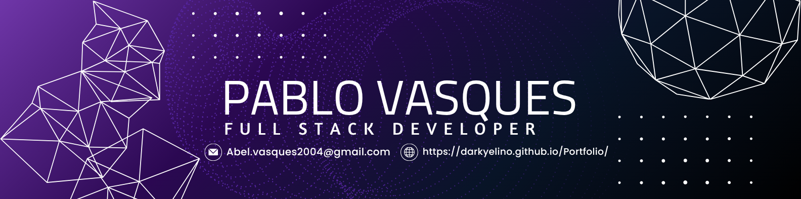

  

#

### 🎓 About Me

- 👨‍🎓 **Graduando em Sistemas de Informação - UFAC**
- 🔍 Desenvolvedor  Web Full-Stack
- 💼 Estagiário no Parque Zoobotânico da UFAC como **desenvolvedor pleno full-stack**

---

### 🛠️ My Stack 

---

### 📊 GitHub Stats

  
  

---

### 🤝 Contact

  
  
  
  

